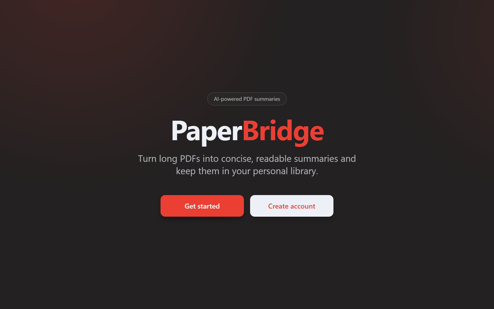
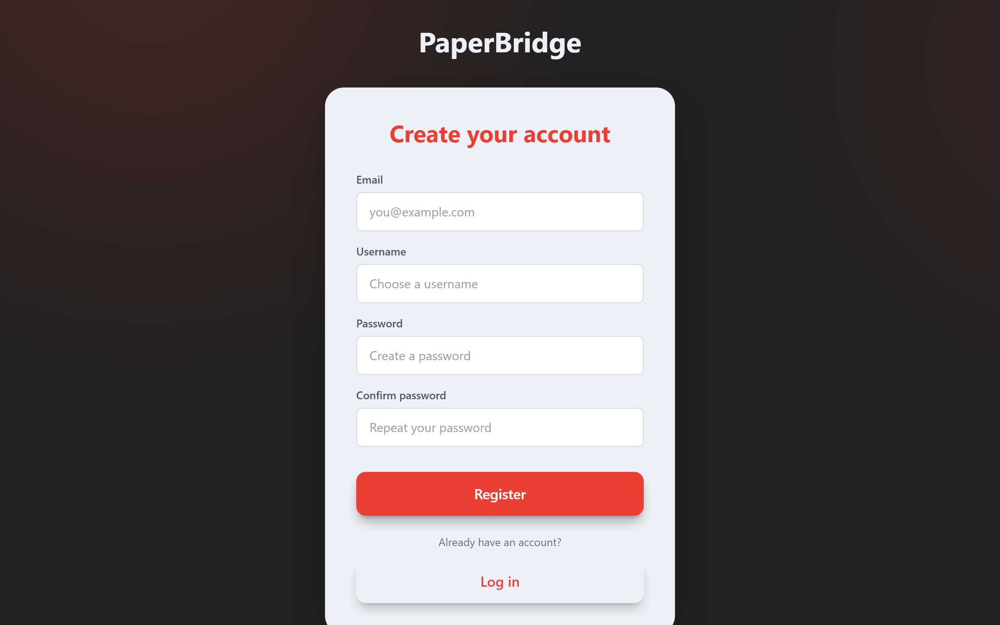
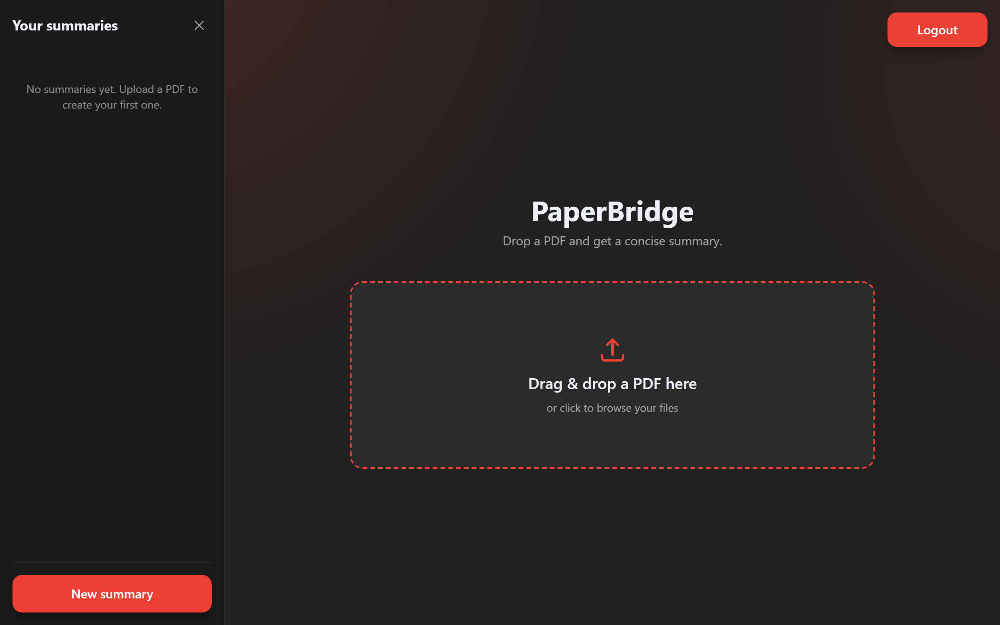
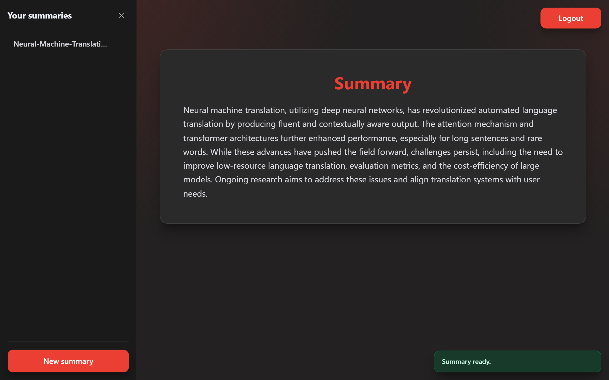

# PaperBridge

A web app that turns long PDFs into concise, readable summaries. Sign in, upload a document, and get an AI-generated summary saved to your personal library for later access.

> Also referred to as **summarizer.ai / Paperbridge.ai**.

---

## Screenshots

| Home | Sign up |
| --- | --- |
|  |  |

| Upload a PDF | Generated summary |
| --- | --- |
|  |  |

---

## Features

- **PDF upload & text extraction** — drop in a PDF and extract its text client-side (`react-pdftotext`, `pdfjs-dist`).
- **AI summarization** — the extracted text is condensed into a summary via the Cohere API.
- **Accounts** — email/password authentication with Supabase Auth; the summarizer is gated behind a logged-in session.
- **Personal summary library** — every summary is stored per-user in Supabase and listed in a sidebar, ordered by date.
- **Multi-page UI** — Home, Login, Register and Summarizer views via React Router.

---

## How it works

```
Login (Supabase Auth)
   -> upload PDF
   -> react-pdftotext extracts the text (in the browser)
   -> text sent to the Express proxy (src/server.js) -> Cohere API -> summary
   -> summary saved to Supabase (papers table, per user)
   -> rendered in the app + listed in the sidebar
```

The **Express** proxy (`src/server.js`) is the only place the Cohere API key lives. The browser talks to the proxy, never to Cohere directly, so the key never ends up in the client bundle.

---

## Tech stack

| Area | Technologies |
|------|--------------|
| Frontend | React 19, Vite, Tailwind CSS 4 |
| Routing | React Router (react-router-dom 7) |
| Auth & database | Supabase (Auth + PostgreSQL) |
| AI | Cohere API, called through an Express proxy that keeps the key server-side |
| PDF | react-pdftotext (client-side text extraction) |

---

## Project structure

```
PaperBridge/
├─ src/
│  ├─ App.jsx            # routes: Home, Login, Register, Summarizer
│  ├─ Home.jsx           # landing page
│  ├─ Login.jsx          # sign in
│  ├─ SignIn.jsx         # registration
│  ├─ Summarizer.jsx     # upload, summarize, save, list
│  ├─ FileUploader.jsx   # PDF upload UI
│  ├─ Sidebar.jsx        # summary library
│  ├─ supabaseClient.js  # Supabase client (public anon key)
│  └─ server.js          # Express proxy that calls the Cohere API
└─ index.html
```

---

## Running locally

The app is in `PaperBridge/`. It runs as two processes: the Vite frontend and the Express proxy.

```bash
cd PaperBridge
npm install
cp .env.example .env   # then fill in the values

npm run server         # starts the proxy on http://localhost:3001
npm run dev            # starts the frontend (in a second terminal)
```

---

## Configuration

Copy `PaperBridge/.env.example` to `PaperBridge/.env` and fill it in (never commit real keys):

- `COHERE_API_KEY` (server) - Cohere API key used by the proxy. Not prefixed with `VITE_`, so it stays out of the client bundle.
- `VITE_API_URL` (client) - base URL of the proxy. Defaults to `http://localhost:3001`.
- `PORT` (server, optional) - proxy port. Defaults to `3001`.

The Supabase **anon key** in `supabaseClient.js` is public by design; access is meant to be enforced through Supabase **Row Level Security** policies.

---

## Notes & future work

- Summary requests go through the Express proxy so the Cohere key stays server-side. When deploying, host the proxy (or port it to a serverless function) and point `VITE_API_URL` at it.
- Row Level Security must be enabled on the `papers` and `users` tables so each user can only read their own rows.
- Long documents are summarized in chunks (map-reduce), capped at the first 8 chunks (~30k characters); anything beyond that is skipped and the app flags it.
- The auth and summarizer routes are code-split, so the heavy PDF library only loads when the summarizer is opened.

---

## Author

Cristian Francesco Pennino — [GitHub](https://github.com/HYP3R-08)
